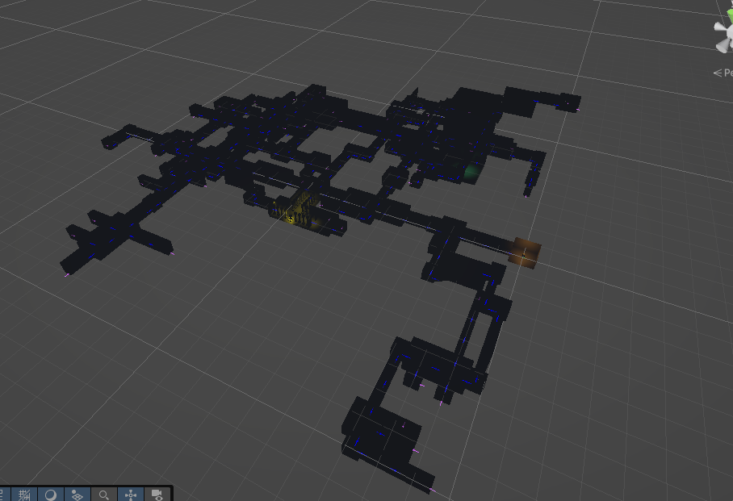

#  Slop-Unity-Dungeon-Generator

A dungeon generator for unity, shouldnt be overly difficult to use and i tried to make it easily integratable into anything. It stiches prefabs together, given a variety of params; depth, required rooms, seed and your list of prefabs.

How to use:
To begin, make some Room Types, by editing the enum.
Then make some prefabs for the generator! These will need 1 enter and any number of exit nodes with the corresponding enter.cs and exit.cs, and the root of the prefab. should have Room.cs. In Room.cs ensure you have attached all Exit Nodes and the Enterance node. Feel free to look at the included prefabs.
We will also need a start / root prefab that has a enter node to work as a player spawnpoint and  1 or more exits.
Create a empty node in your scene and attach the Generator Script. Take a look through the settings, but importantly ensure to attach the start prefab, and add your prefabs to randomly generate in Random Room Settings.
Now call Generate(); in the Generator.cs script or tick generateOnStart.
The generator will create a new scene for the dungeon.

## Screenshots

## Lessons Learned

- Asynchronous Programming for generation,
- Procedural Generation using Random Number generation and weightings

## Authors

- [@MothInBox](https://github.com/MothInBox)

